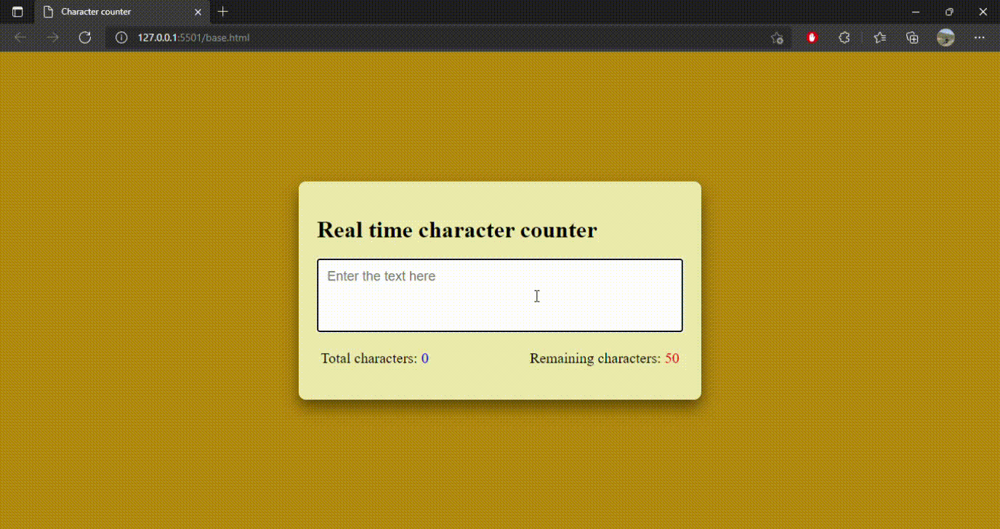

# Character Counter
* Basic webpage that contains a textbox with a character limit of 50
* For each character inserted, a counter will show the number of characters entered and the characters remaining till the limit is reached

## DEMO:
